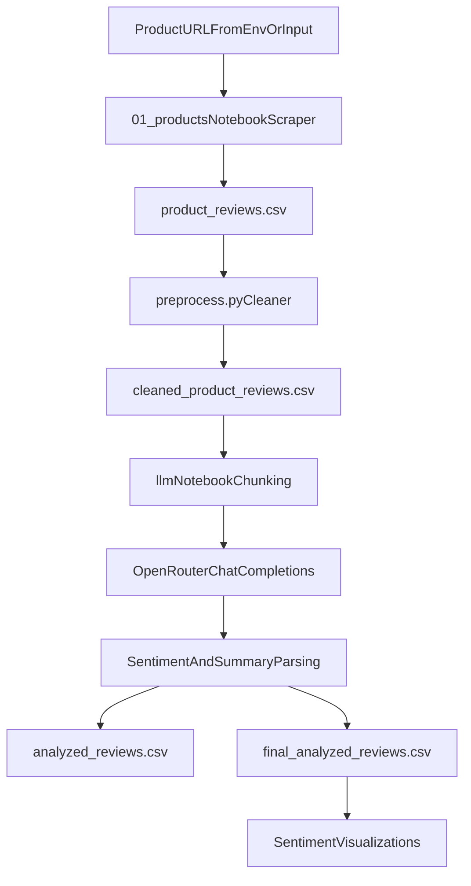

# Flipkart Review Scraper + LLM Summarizer

This project builds an end-to-end pipeline to:
- scrape customer reviews from a Flipkart product page,
- clean and normalize raw review text,
- send processed review chunks to OpenRouter for sentiment and summary generation,
- store structured outputs in CSV files for further analysis.

## Chosen Product URL

The configured product URL is:

`https://www.flipkart.com/motorola-edge-60-fusion-5g-pantone-amazonite-128-gb/p/itm0ba5c1f57331a?pid=MOBHHD2KXMH9NCYG`

<!-- It is also present in `.env` as `PRODUCT_URL`. -->

## A Short Demonstration Video

A short video (3 minutes) demonstrating application's functionality, showcasing the scraping process, LLM interaction, and the final output.

`https://drive.google.com/file/d/1iAY47oOZTt7n-F7bJ2Oy67x8Dsp31kMH/view?usp=sharing`

## Project Structure

- `01_products.ipynb`: Scrapes review pages from Flipkart and saves raw reviews.
- `preprocess.py`: Cleans review text and removes noise words.
- `llm.ipynb`: Chunks cleaned reviews, calls OpenRouter API, parses responses, and saves analyzed outputs.
- `.env`: Environment variables (`API_KEY`).
- `requirements.txt`: Python dependencies.

## How The Pipeline Works



## Setup

### 1) Prerequisites

- Python 3.10+ recommended
- Internet connection (for scraping + API calls)
- OpenRouter API key

### 2) Create and activate a virtual environment

Windows (PowerShell):

```powershell
python -m venv .venv
.venv\Scripts\Activate.ps1
```

Mac/Linux:

```bash
python -m venv .venv
source .venv/bin/activate
```

### 3) Install dependencies

```bash
pip install -r requirements.txt
```

### 4) Configure environment

Update `.env`:

```env
API_KEY="your_openrouter_api_key_here"
```

## Run Instructions (End-to-End)

Run these in sequence:

### Step 1: Scrape reviews

Open and run `01_products.ipynb`.

What it does:
- asks for product URL input (`Please Enter the URL of the product (Flipkart):`),
- transforms it into Flipkart review endpoint,
- scrapes review text + relative/absolute date info,
- converts date info to `days`,
- saves output to `product_reviews.csv`.

### Step 2: Preprocess review text

Run:

```bash
python preprocess.py
```

What it does:
- reads `product_reviews.csv`,
- lowercases text,
- removes non-ASCII chars/emojis,
- removes punctuation/special chars,
- normalizes whitespace,
- removes basic noise words (`pros`, `cons`, `drawback`, `problem`),
- saves output to `cleaned_product_reviews.csv`.

### Step 3: LLM summarization + sentiment analysis

Open and run `llm.ipynb`.

What it does:
- loads `.env` and reads `API_KEY`,
- loads `cleaned_product_reviews.csv`,
- groups reviews into structured chunks (word-limit based),
- calls OpenRouter endpoint `https://openrouter.ai/api/v1/chat/completions`,
- uses model `google/gemini-2.0-flash-001`,
- parses model output into sentiment + concise summary,
- saves intermediate `analyzed_reviews.csv`,
- saves final `final_analyzed_reviews.csv`,
- generates sentiment plots (`sentiment_overview_fixed.png`, `sentiment_trend.png`).

## Output Files

- `product_reviews.csv`
  - Raw scraped review dataset (from notebook scraper).
  - Core fields: `days`, `content`.

- `cleaned_product_reviews.csv`
  - Cleaned text version of raw reviews.
  - Adds/updates: `cleaned_review`.

- `analyzed_reviews.csv`
  - LLM response attached to review records (intermediate).

- `final_analyzed_reviews.csv`
  - Parsed and structured final dataset.
  - Includes sentiment and summary fields used for reporting/visualization.

## Design Choices

- **Notebook-first workflow**: Scraping and model experimentation are in notebooks for iterative analysis and quick debugging.
- **Separate preprocessing script**: Text cleaning is isolated in `preprocess.py` for reproducibility and easier reruns.
- **Chunk-based prompting**: Reviews are batched with a word threshold to reduce context overflow and keep API requests practical.
- **Simple, practical parsing**: LLM output is parsed into structured columns, then sentiment labels are normalized for cleaner analytics.
- **Basic resilience**: Network/API call errors are wrapped in `try/except`, and chunk loop includes delays (`time.sleep(10)`) to reduce request pressure.

## Limitations

- **Website structure dependency**: Flipkart DOM/class names can change, which may break scraping selectors.
- **Potential blocking/rate limits**: Large page crawls can trigger server-side blocks, captchas, or 429/5xx responses.
- **URL source mismatch**: `01_products.ipynb` currently asks for URL via input; it does not automatically consume `PRODUCT_URL` from `.env`.
- **Metadata scope**: Current scraper reliably stores `days` + `content`; other metadata (e.g., rating/title/helpful votes) is not fully persisted in final CSV by default.
- **LLM output formatting assumptions**: Parsing logic expects model responses in a specific structure; malformed output may cause partial parsing.
- **Cost and quota**: OpenRouter usage depends on API credits and model availability.

## Error Handling Present Today

- Scraper uses request-level `try/except` around page fetches.
- LLM loop wraps API call/parsing with `try/except` and continues processing next chunks.
- Delay between chunks helps with API stability under repeated calls.

## Troubleshooting

- **`401` / auth errors**: Verify `API_KEY` in `.env`.
- **`429` / rate-limited**: Increase sleep interval, reduce chunk frequency, rerun failed chunks.
- **`5xx` from Flipkart**: Retry later; reduce request burst; confirm URL is valid.
- **Empty/short CSV output**: Check whether scraping selectors still match current Flipkart page layout.
- **Encoding/text artifacts**: Re-run preprocessing; verify CSV is saved/read with UTF-8.

## Future Improvements

- Load `PRODUCT_URL` directly from `.env` in the scraping notebook.
- Add retries with exponential backoff for network/API failures.
- Persist richer metadata (`rating`, `review_title`, `author`, `helpful_count`) where available.
- Add command-line runner to execute all 3 stages non-interactively.
- Add tests for cleaner functions and response parsing.

## Quick Reproduction Checklist

1. Set `API_KEY` in `.env`.
2. Install dependencies.
3. Run `01_products.ipynb` and provide the Flipkart URL.
4. Run `python preprocess.py`.
5. Run `llm.ipynb`.
6. Open `final_analyzed_reviews.csv` for final results.
